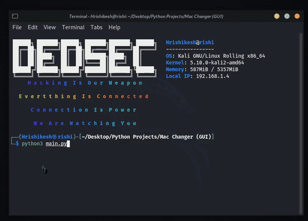

# Mac Changer For Linux With GUI
A simple Python GUI application to change mac address of Linux

**Made In Python(3.9.1) With Tkinter GUI**

## Usage

1. Public wifi get unlimited attempt at full high speed(Airport, Indian railway station) via change your mac address
2. Bypass mac filtering
3. Some places required to register mac address to access internet(e.g. institute) bypass them

## Features 

1. Simple & Clean UI
2. You can generate MAC Address randomly
3. You can generate MAC Address randomly with any company (e.g. Apple, Sony etc.) prefix
4. You can set manual generated MAC Address
5. You can backup your current MAC Address in case of something went wrong
6. It Create A Complete Log File To Keep Record Of Changing Mac History

## Requirements

- getmac
- generate_mac

## Installation

- Download Repository

`Direct Download Zip` [Click Here](https://github.com/Hrishikesh7665/Mac-Changer-GUI/archive/main.zip)

- Or

- Clone Repository

git clone https://github.com/Hrishikesh7665/Mac-Changer-GUI.git

- Install Required Modules

1. sudo pip3 install getmac
2. sudo pip3 install python-generate-mac

- Or

sudo pip3 install -r requirements.txt

- Run

python3 "main.py"

**N.B: If You Getting “No Module Tkinter” Error Try This:**

*sudo apt-get install python3-tk*

*sudo pacman -S tk* (For Arch)

## Demo

**Drop a STAR if you like it!!!😃**
